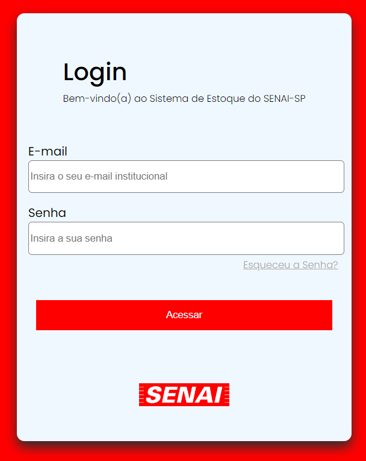
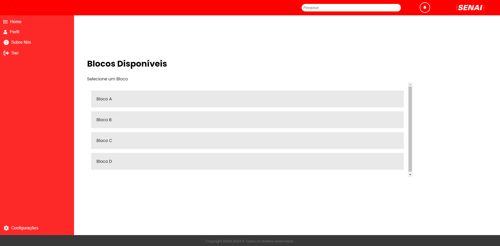

# Front-End

Responsável pelo Front-End:
- Eduardo Sinico

## Construção do Layout:

Figma: 

# Implementação e Construção do layout Site:

## Página de Login:

A primeira página a ser construída, foi a página de Login. É também a primeira página a ser apresentada ao usuário. 

Login: 

## Página Home:

Efeito de Carregamento:

  
Página Home:

