### Grupo: Heitor, Sinico, Rafael
### Foco: Controlar os ambiente, gestão de ambientes

---

### Objetivos:
<ul>
  <li>Patrimônio dividido por sala</li>
  <li>Os objetos dentro da sala pertencem ao patrimônio da sala</li>
  <li>Uma pessoa é responsável pelo patrimônio da sala, 1 por sala, professor etc</li>
  <li>Verificação feita 1 vez por ano</li>
  <li>Cada patrimônio mesmo se der problema não pode ser jogado fora</li>
  <li>Cada patrimônio tem um número</li>
  <li>Verificação do tempo de manutenção, formatação, requisitos da máquina, sistemas operacional ativo, chave etc.</li>
  <li>Campo para movimentação de patrimônio</li>
  <li>Registro de transferências</li>
  <li>Registro de transferências de patrimônio deve ser aprovado por um gestor um cargo acima</li>
  <li>Itens consumiveis</li>
  <li>Separar por setor os itens consumiveis</li>
</ul>

## Modelo Conceitual:

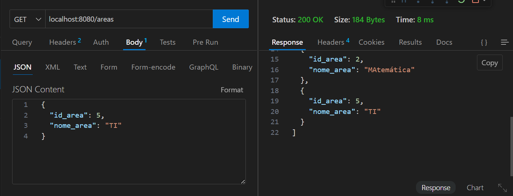

## Utilização de API
---
### Responsaveis

  Method Get:
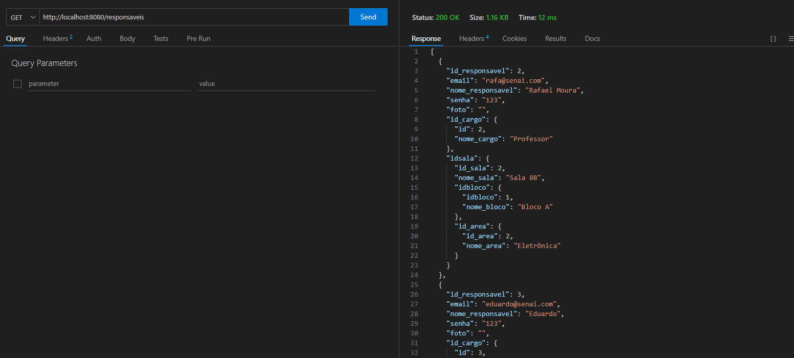

  Method Post:
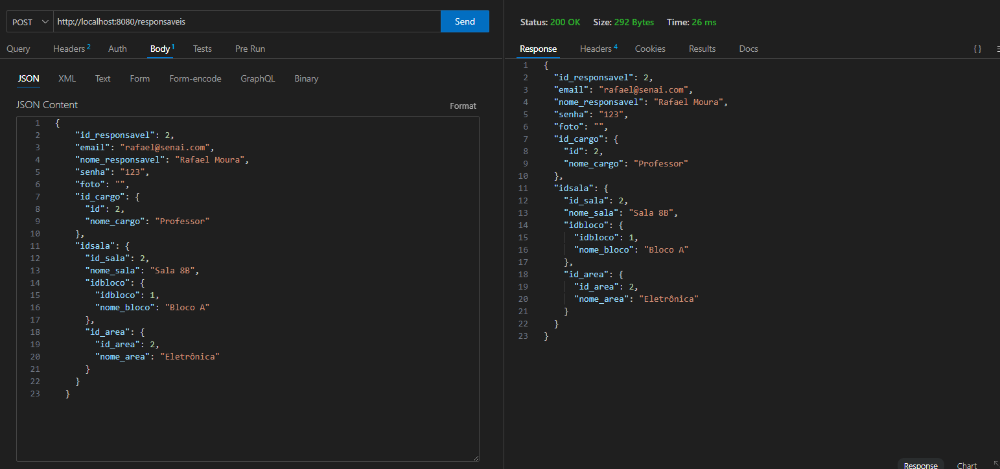

  Method Put:
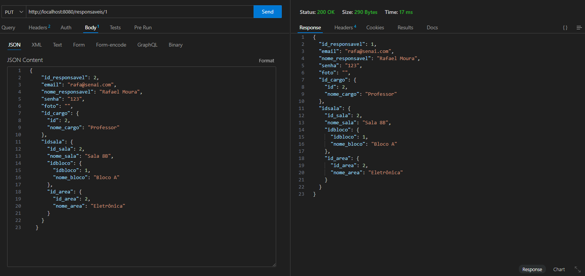

  Method Delete:
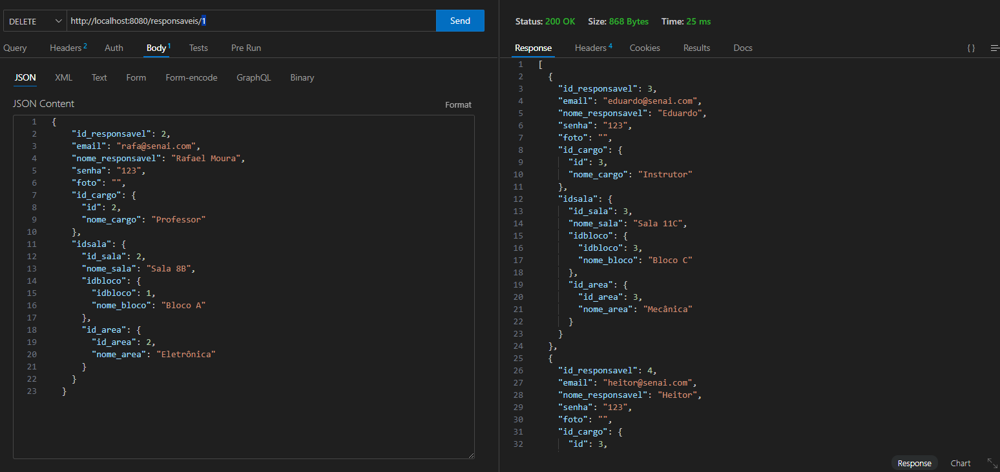

---
### Salas

  Method Get:
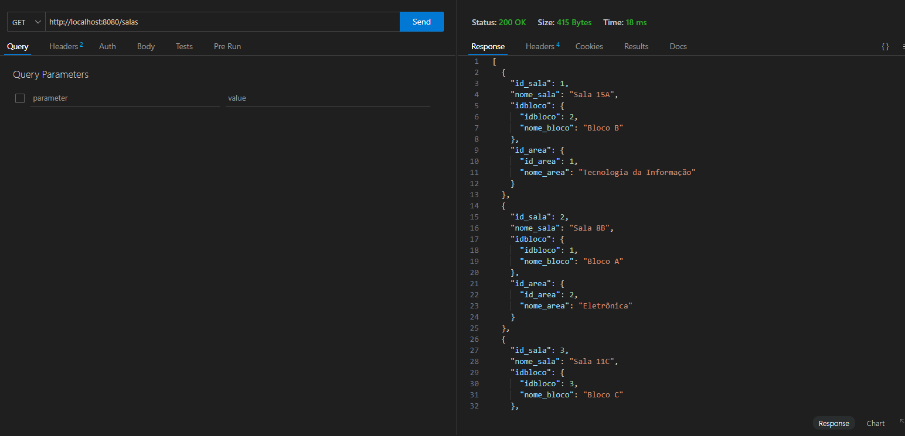

  Method Post:
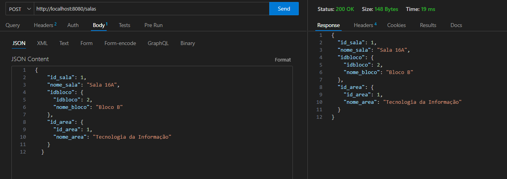

  Method Put:
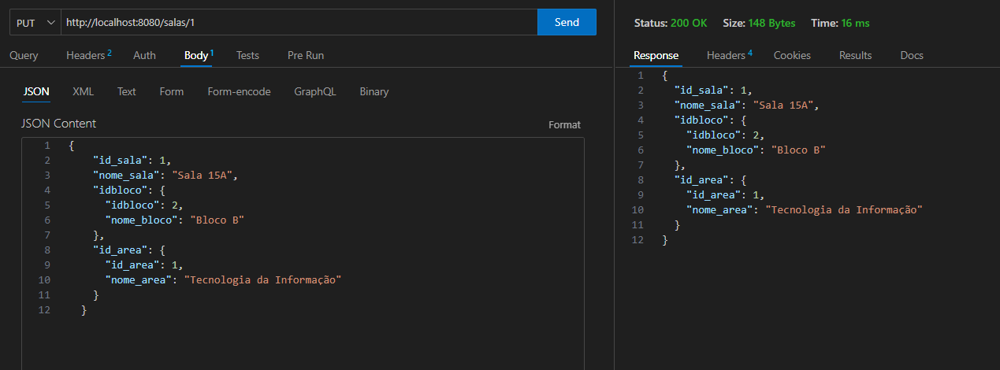

  Method Delete:

---
### Areas

  Method Get:
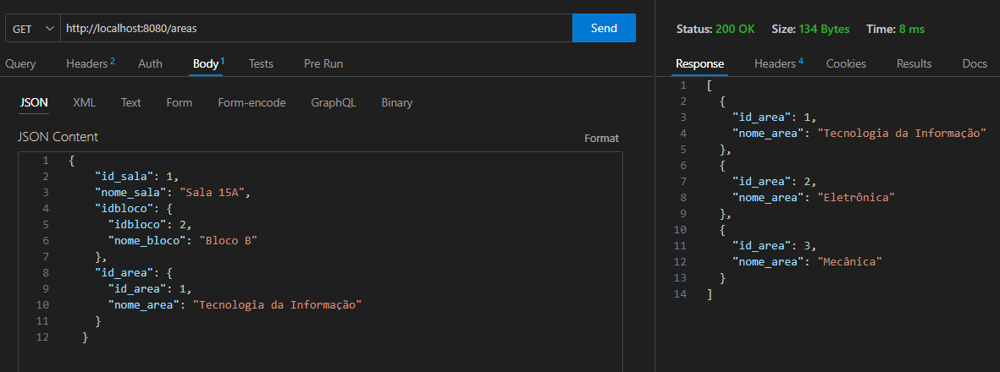

  Method Post:
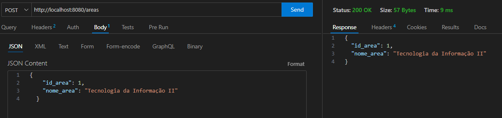

  Method Put:
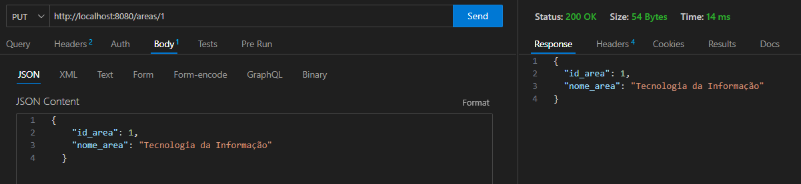

  Method Delete:

---
### Cargos

  Method Get:
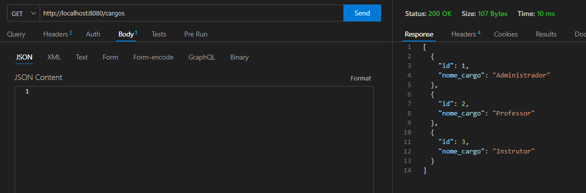

  Method Post:
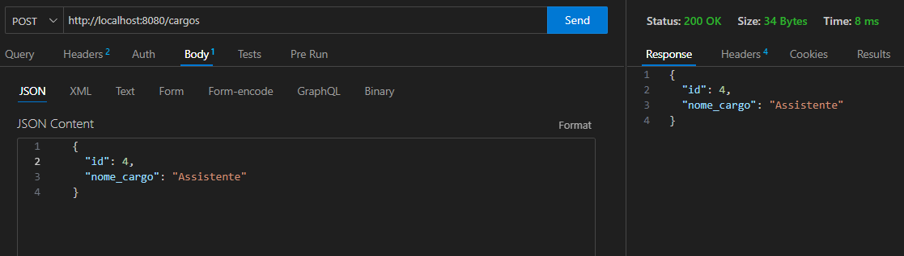

  Method Put:
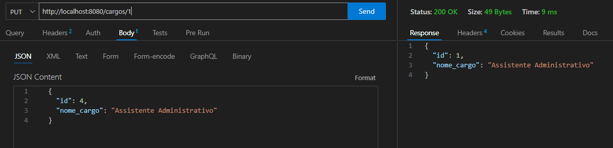

  Method Delete:
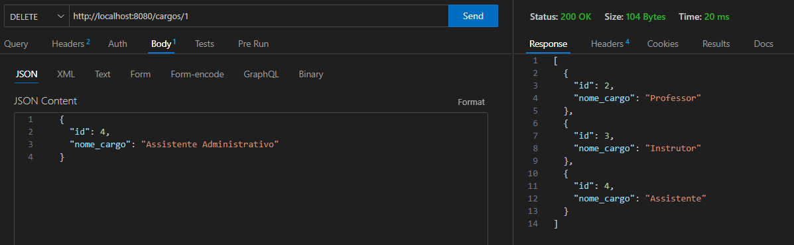

---
### Estoque

  Method Get:
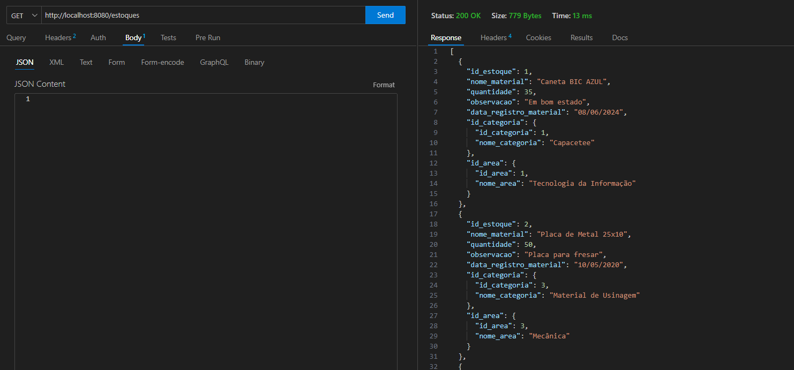

  Method Post:
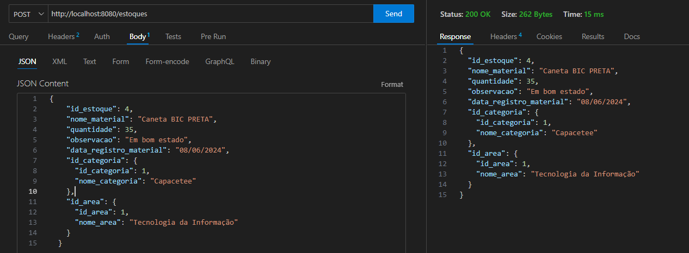

  Method Put:
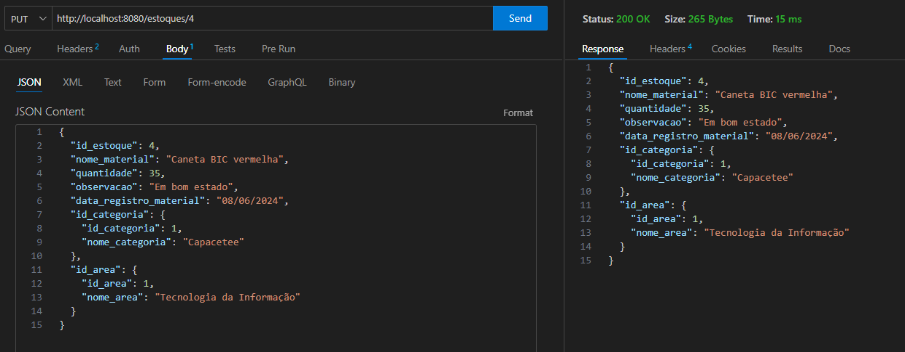

  Method Delete:

---
### Transferências

  Method Get:

  Method Post:

  Method Put:

  Method Delete:

---
### Patrimônios

  Method Get:

  Method Post:

  Method Put:

  Method Delete:

---

---
## Cores do Site

| Cor               | Hexadecimal                                                |
| ----------------- | ---------------------------------------------------------------- |
| Cor exemplo       |  #0a192f |
| Cor exemplo       |  #f8f8f8 |
| Cor exemplo       |  #00b48a |
| Cor exemplo       |  #00d1a0 |

  
