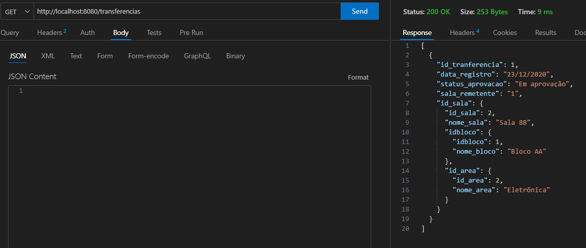
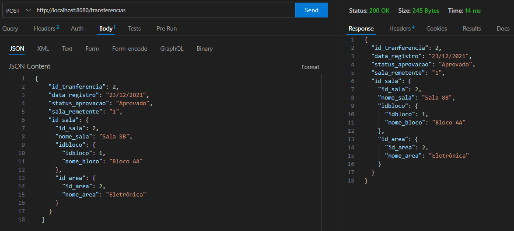
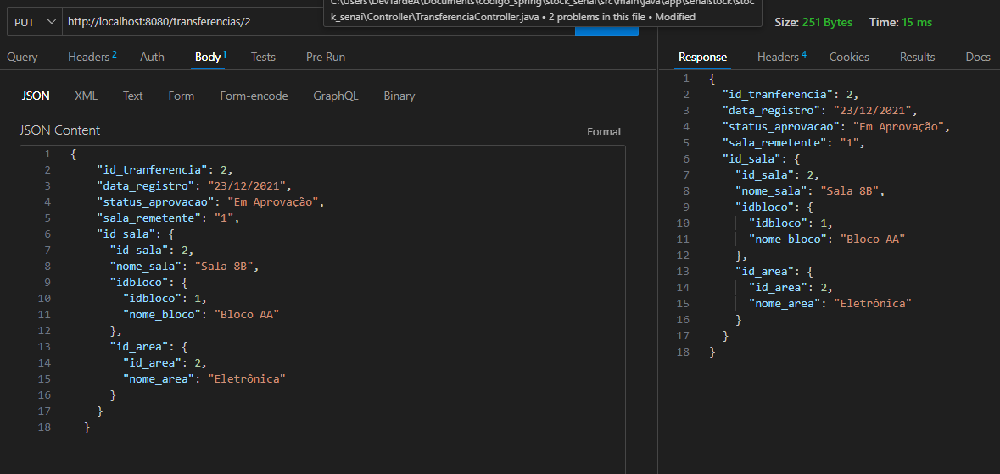
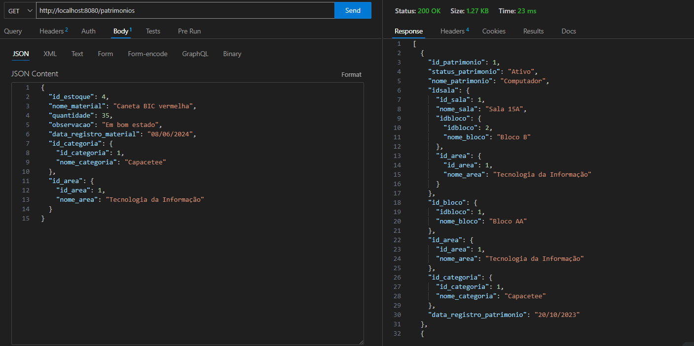
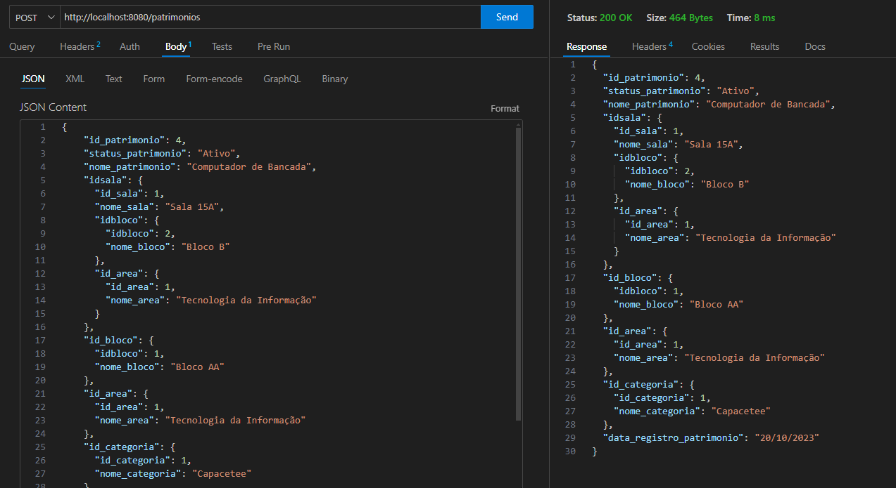
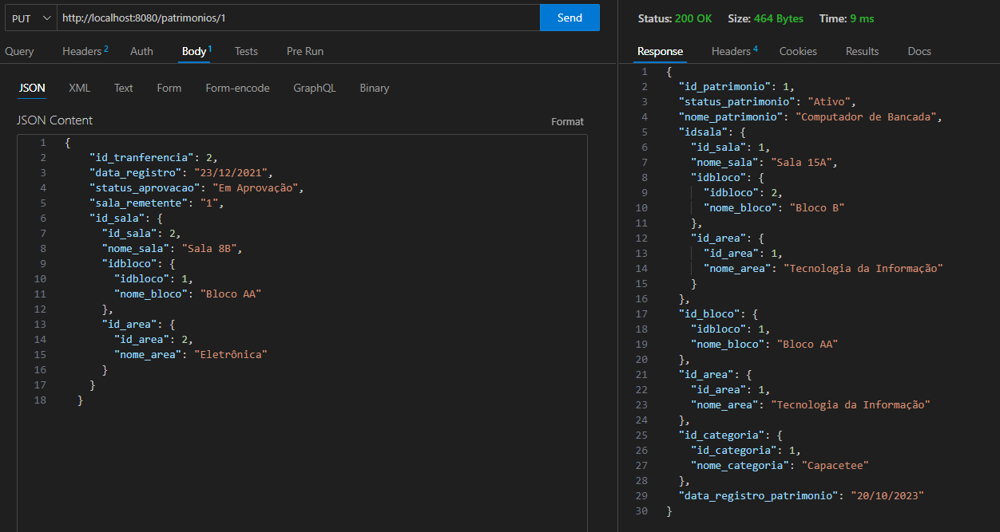

 
  <h1> ⚙🛠🎯 Gestão de Patrimônios e Estoque 🎯🛠⚙  </h1>

 

## Visão Geral do Projeto

O projeto Senai-Stock foi desenvolvido com o objetivo de criar um sistema de controle de estoque e patrimônio para uma escola, dividido entre patrimônio e itens consumíveis. O sistema permite a gestão eficiente de recursos, associando cada item a uma sala específica e designando um responsável por cada sala. Também facilita a verificação periódica e o registro de transferências e manutenção de patrimônio.

## [Plano de Negócios](https://github.com/senai-stock/stock_project/blob/main/plano%20de%20neg%C3%B3cios.txt)

## Objetivos:
<ul>
  <li>Patrimônio dividido por sala</li>
  <li>Os objetos dentro da sala pertencem ao patrimônio da sala</li>
  <li>Uma pessoa é responsável pelo patrimônio da sala, 1 por sala, professor etc</li>
  <li>Verificação feita 1 vez por ano</li>
  <li>Cada patrimônio mesmo se der problema não pode ser jogado fora</li>
  <li>Cada patrimônio tem um número</li>
  <li>Verificação do tempo de manutenção, formatação, requisitos da máquina, sistemas operacional ativo, chave etc.</li>
  <li>Campo para movimentação de patrimônio</li>
  <li>Registro de transferências</li>
  <li>Registro de transferências de patrimônio deve ser aprovado por um gestor um cargo acima</li>
  <li>Itens consumiveis</li>
  <li>Separar por setor os itens consumiveis</li>
</ul>

 
## 🛠 Linguagem
- **Spring Boot**: O Spring Boot é um framework `Java` que simplifica o desenvolvimento de aplicativos, enquanto o `JPA` oferece uma maneira fácil de acessar e manipular dados em bancos de dados relacionais, facilitando o desenvolvimento de aplicativos.
- 
- 
  

---

<h2> Modelo Conceitual: </h2>

 
  

 

  
## API RESTFUL

### Responsaveis

  Method Get:

  Method Post:

  Method Put:

  Method Delete:

---
### Salas

  Method Get:

  Method Post:

  Method Put:

---
### Areas

  Method Get:

  Method Post:

  Method Put:

---
### Cargos

  Method Get:

  Method Post:

  Method Put:

---
### Estoque

  Method Get:

  Method Post:

  Method Put:

---
### Transferências

  Method Get:

  Method Post:

  Method Put:

---
### Patrimônios

  Method Get:

  Method Post:

  Method Put:

---

## FrontEnd 

- [Pasta com Imagens](https://github.com/senai-stock/stock_project/tree/main/front-images)
- [Imagens FrontEnd](https://github.com/senai-stock/codigo_spring/blob/FrontEnd-Edu/README.md)

---

## Conclusão
A experiência de criar o projeto Senai-Stock foi enriquecedora, pois envolveu a aplicação de várias tecnologias e práticas de desenvolvimento em um cenário prático. Desde a definição do modelo de dados até a implementação de serviços e controladores, cada etapa contribuiu para a construção de um sistema completo e funcional. O resultado final é uma aplicação robusta que atende aos requisitos do controle de patrimônio e estoque de uma escola, facilitando a gestão e o rastreamento de recursos de maneira eficiente.

---
## Autores

- [@hunter7210](https://www.github.com/hunter7210)

- [@rafaelmoura23](https://www.github.com/rafaelmoura23)

- [@Edu1Sinico](https://www.github.com/Edu1Sinico)
