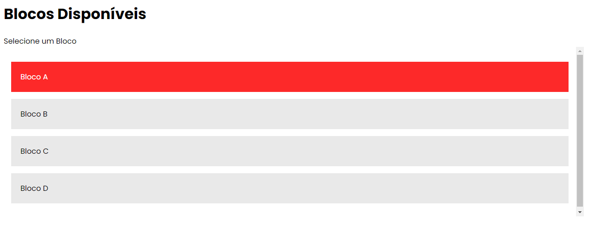

# Front-End

Responsável pelo Front-End:
- Eduardo Sinico

## Construção do Layout:

Figma: 

# Implementação e Construção do layout Site:

## Página de Login:
 
A primeira página a ser construída, foi a página de Login. É também a primeira página a ser apresentada ao usuário. 

Login: 

## Página Home:
 
Efeito de Carregamento:

  
Página Home:

  
Listagem de Blocos:

  
## Página de Listagem de Salas:
 

  

  

  

